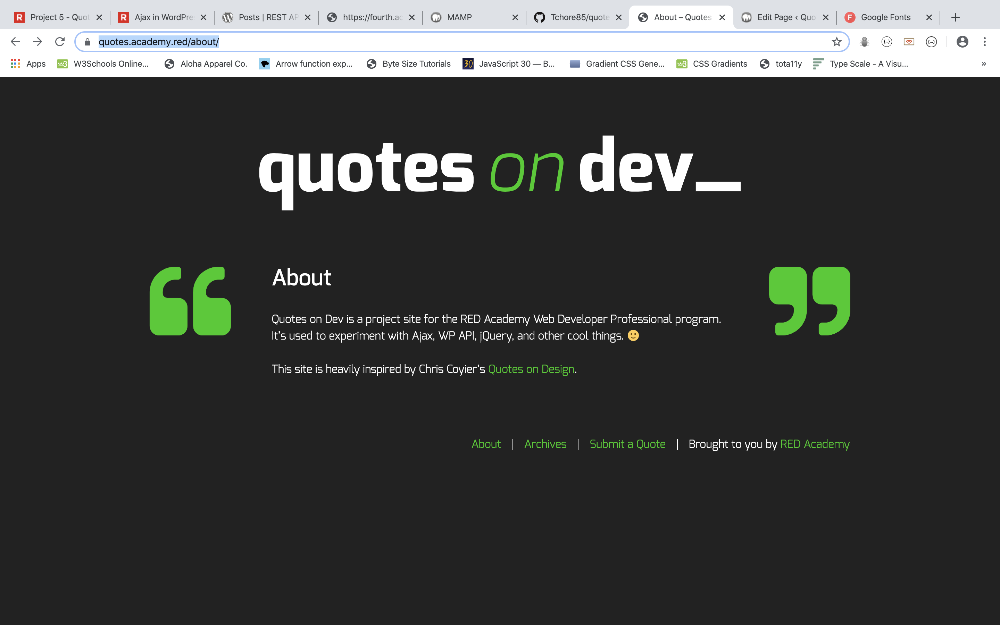
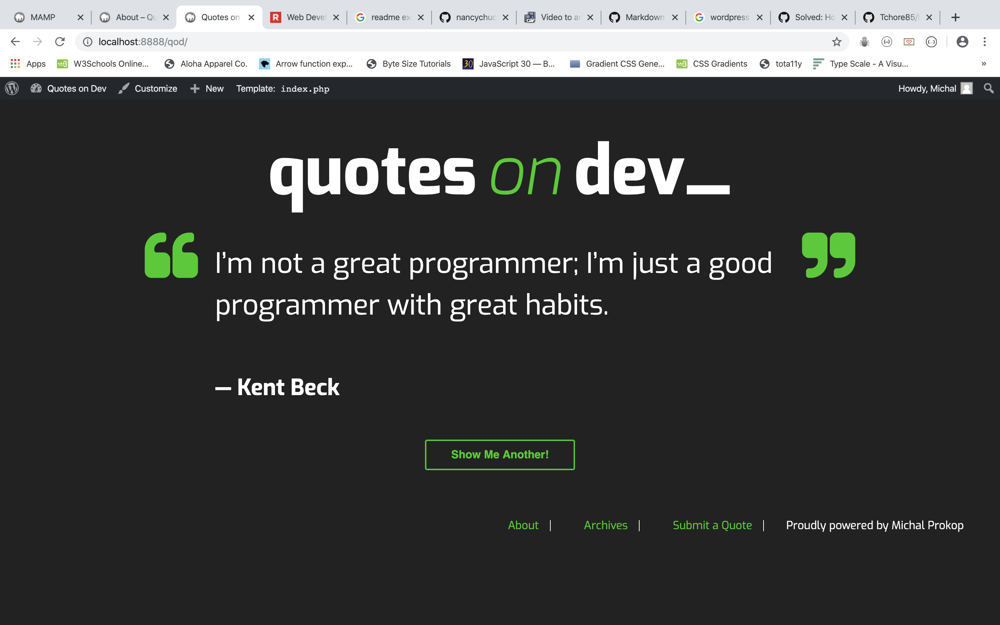

# Quotes on Dev

### Project description

In This project, the main focus is on creating the Underscores Theme in Word Press. In the Document is applied knowledge of WordPress template hierarchy as well as actively using the Jason data based on aJax Functions using methods such a PUSH and POST.

## Key Learnings

- aJax in WordPress functions
- WordPress Functions
- WordPress Custom Loops
- WordPress Database
- WordPress Underscores Theme
- WordPress Customs Plug-ins
- PHP and his structure
- WP_Query and get_posts
- Installing and using Gulp
- Applying SASS structure
- Working with the Git
- Java Vanilla and Jquery

# Prerequisites

The project required installing and downloading the WordPress files. Those files were required to start creating the Underscores Theme.

# Technologies Used

- HTML
- Css
- Java Script
- jQuery
- PHP
- Word Press

# Author:

Michal Prokop
Web developer student at Red Academy
Vancouver, Canada, BC
